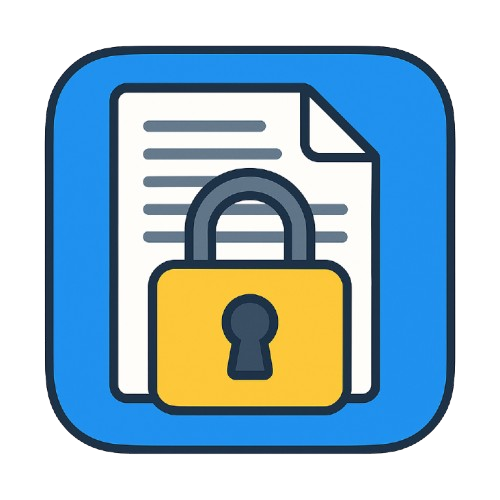

<div align="center">



# Fat Lock Action

[](https://github.com/bohdanbirdie/fat-lock-action/actions/workflows/linter.yml)

[](https://github.com/bohdanbirdie/fat-lock-action/actions/workflows/codeql-analysis.yml)

</div>

A GitHub Action that monitors the size of lock file changes in pull requests. It
helps prevent accidental lock file regeneration and ensures that dependency
changes are intentional. 🔐

## Features

- Monitors changes in package lock files (`package-lock.json`, `yarn.lock`,
  etc.)
- Comments on PRs when lock file changes exceed a specified threshold
- Can fail CI checks if changes are too large
- Configurable thresholds and file paths
- Supports multiple lock file formats

## Usage

Add this action to your workflow:

```yaml
name: Check Lock File Changes

on: [pull_request]

jobs:
  check-lock:
    runs-on: ubuntu-latest
    steps:
      - uses: actions/checkout@v4
      - uses: bohdanbirdie/fat-lock-action@v1
        with:
          github-token: ${{ secrets.GITHUB_TOKEN }}
          size-threshold: 1000
          lock-file-path: 'package-lock.json'
          comment-enabled: true
          fail-if-exceeded: true
```

## Configuration

| Input              | Description                                          | Required | Default             |
| ------------------ | ---------------------------------------------------- | -------- | ------------------- |
| `github-token`     | GitHub token for API access                          | Yes      | N/A                 |
| `size-threshold`   | Maximum number of lines changed in lock file         | No       | `1000`              |
| `lock-file-path`   | Path to the lock file to monitor                     | No       | `package-lock.json` |
| `comment-enabled`  | Whether to comment on PR when threshold is exceeded  | No       | `true`              |
| `fail-if-exceeded` | Whether to fail the check when threshold is exceeded | No       | `true`              |
